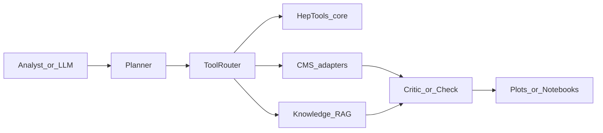

# CMS-oriented agent layout (GSoC 2c proposal)

**PDF write-up (Task 2c only):** [`docs/GSoC26_Task2c_Report.pdf`](docs/GSoC26_Task2c_Report.pdf) · source [`docs/GSoC26_Task2c_Report.tex`](docs/GSoC26_Task2c_Report.tex). Task 2b (super-resolution) lives in a **separate** repo: [`KenWuqianghao/CMS_E2E`](https://github.com/KenWuqianghao/CMS_E2E).

This branch adds a **parallel layout** for *agentic CMS analyses* without disrupting the existing general-purpose `tools/`, `llm/`, and `examples/` tree from upstream HEPTAPOD. The intent is to separate **orchestration** (agents, workflows, prompts, eval) from **vendor-style physics tools** already shipped in `tools/`.

Upstream overview (unchanged): see the root [README.md](README.md).

## Comparison

| Concern | Current HEPTAPOD (upstream) | Proposed `cms_agent/` slice |
| ------- | --------------------------- | --------------------------- |
| Physics tools | `tools/{mg5,pythia,sherpa,pdg,inspire,units,analysis}` | Thin **adapters** under `cms_agent/tools/` that wrap CMS-specific CLIs/libs and delegate to scientific code, keeping HEPTAPOD cores slim |
| LLM plumbing | `llm/`, `prompts/`, `config.py` | `cms_agent/configs/` for model routing + **scoped tool allowlists** per workflow |
| Demos | `examples/` | `cms_agent/workflows/` as explicit graphs (intent → toolchain → validation) |
| Knowledge | Embedded in prompts / paper refs | `cms_agent/knowledge/` for curated CMS snippets, citation cards, RAG manifests |
| Quality | `test_runner.py` | `cms_agent/eval/` golden physics tasks + rubric scoring |

## Execution flow

## Linked ecosystem (from project materials)

The following are **explicit anchors** called out in HEPTAPOD documentation and typical ML4SCI CMS postings; `cms_agent/TOOL_INVENTORY.md` maps them to concrete tool interfaces:

- **HEPTAPOD** — this repository (`tonymenzo/heptapod`).
- **Orchestral AI** — planning/runtime engine referenced in the root README ([orchestral-ai.com](https://orchestral-ai.com)).
- **MCP** — expose stable tool schemas to desktop assistants (see `examples/mcp/`).
- **Design paper** — [arXiv:2512.15867](https://arxiv.org/abs/2512.15867) for run cards and reproducibility framing.
- **CMS analysis stack (illustrative)** — CMSSW, ROOT, `coffea`, `awkward-array`, `vector` (to be wired via adapters, not copied into core).

## Branch policy

Work stays on **`gsoc26-cms-restructure`** in a personal fork/clone. **Do not open a pull request** to the main HEPTAPOD repository for this evaluation task.
